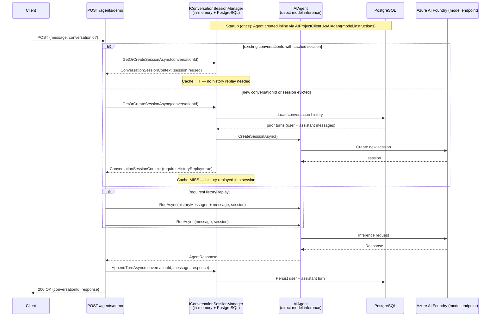
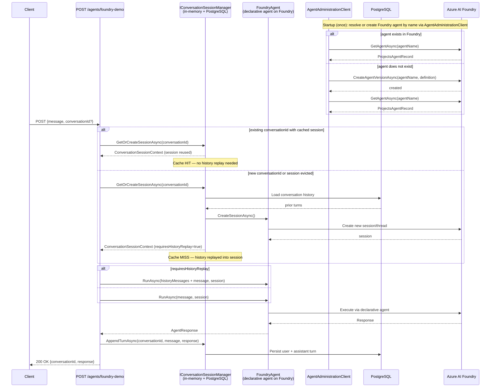
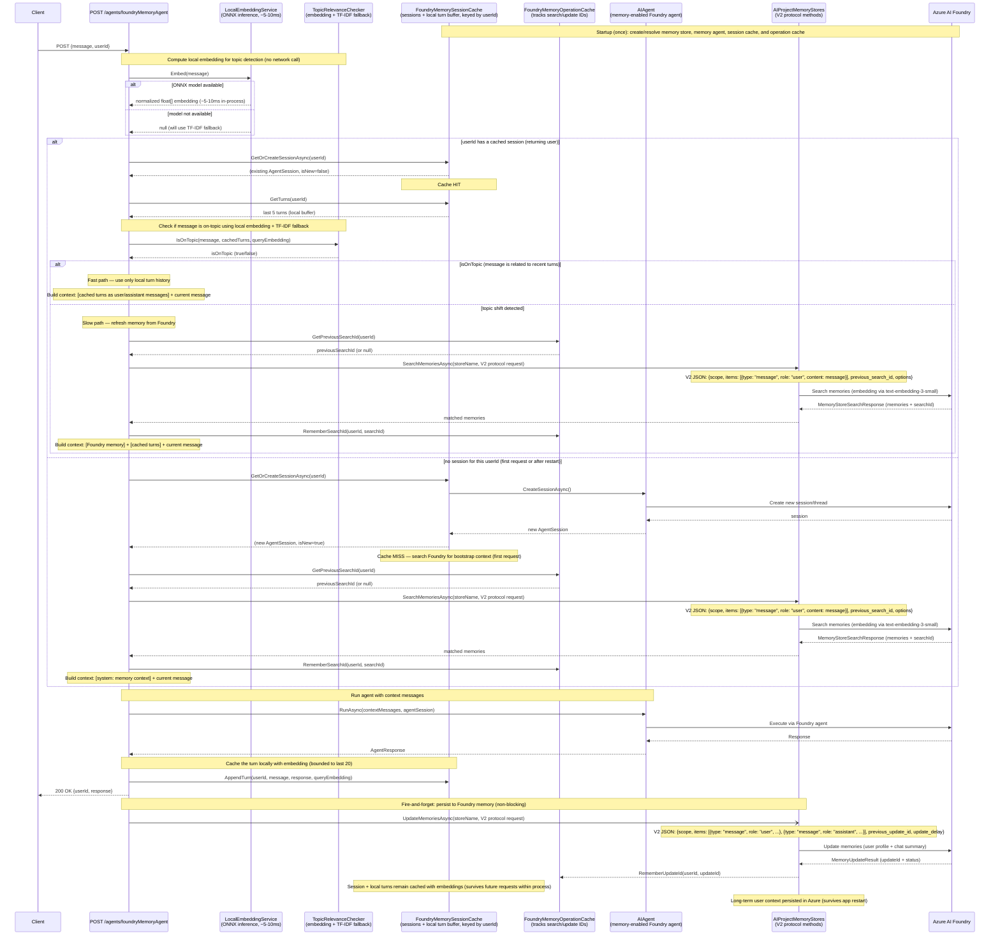

# Agent Hub — Sequence Diagrams

## 1. `/agents/demo` — Direct Model Inference with PostgreSQL Memory

---

## 2. `/agents/foundry-demo` — Foundry-Managed Agent with PostgreSQL Memory

---

## 3. `/agents/foundryMemoryAgent` — Foundry Memory Store with Local Topic Detection

